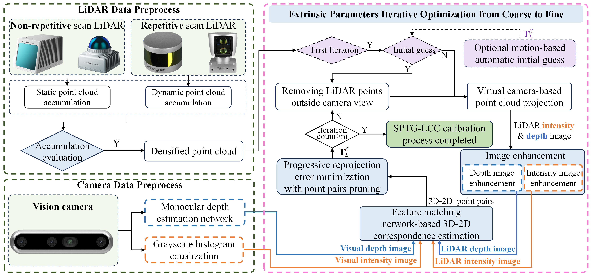
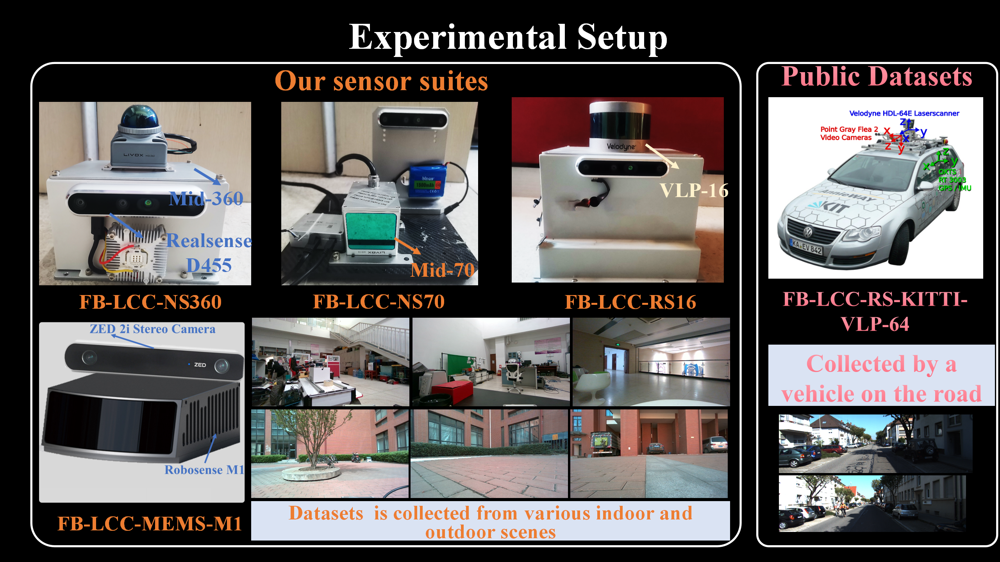
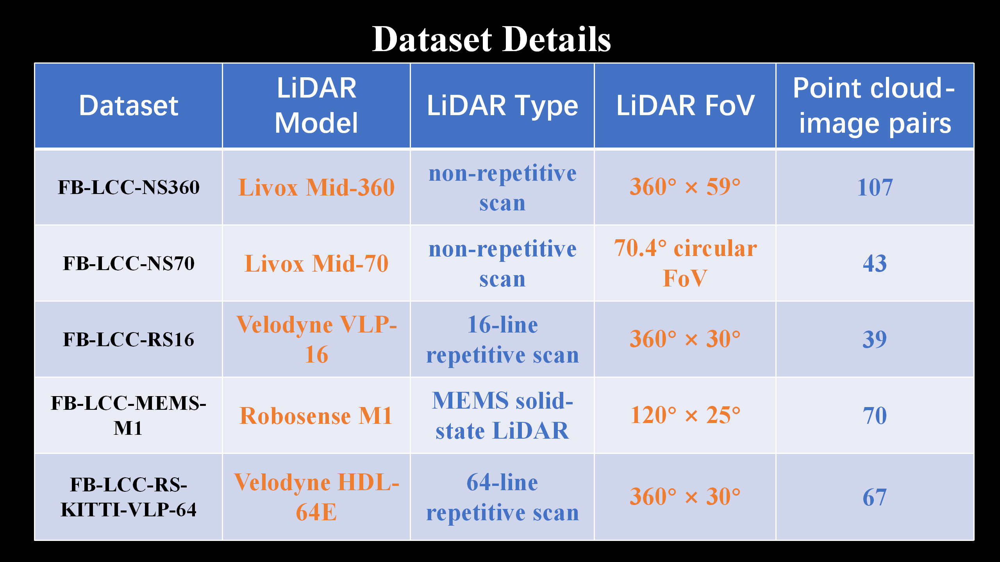

# SPTG-LCC: Single-shot, Pixel-level, Target-free and General LiDAR-Camera Extrinsic Self-Calibration
The data fusion of LiDAR and camera holds vast application prospects, with calibration as a crucial prerequisite. In this paper, we propose SPTG-LCC, a novel, general, and target-free LiDAR-camera extrinsic calibration framework. On the one hand, SPTG-LCC  is open-source, which is very suitable for practitioners seeking a robust, general, and convenient target-free calibration tool. On the other hand, the four diverse datasets are open-source, which is very suitable for researchers to comprehensively evaluate feature-based target-free LiDAR-camera calibration methods.

# Video Link: [Video on Youtube](https://www.youtube.com/watch?v=qKA_KamtwTk) 
# To Do List
The following tasks will be completed quickly and step by step.
 
## Experimental Video
- [x] Video Link:  [Video on Youtube](https://www.youtube.com/watch?v=qKA_KamtwTk) 
## Datasets open-source
our  self-assembled  sensor suites as follows, where the camera is the Realsense D455  and ZED 2i. Four diverse datasets were collected using these four suites,  named **FB-LCC-NS360**, **FB-LCC-NS70**,  **FB-LCC-RS16**, and **FB-LCC-MEMS-M1**,  which are released for evaluating feature-based LiDAR-camera calibration methods. Moreover, sequence 00 on the public KITTI odometry benchmark  is evenly divided into 67 LiDAR-camera data pairs as a dataset, named **FB-LCC-RS-KITTI-VLP-64**.  
|| |
|--------------------------------------------|--------------------------------------------|
- [ ] FB-LCC-NS360:  
- [ ] FB-LCC-NS70
- [ ] FB-LCC-RS16
- [x] FB-LCC-MEMS-M1 [Baidu Cloud Disk] (https://pan.baidu.com/s/1acPQ5RdGDKxyb62OjBmeRA?pwd=zpus )
- [x] FB-LCC-RS-KITTI-VLP-64 : [Baidu Cloud Disk] (https://pan.baidu.com/s/17NBXiui3NjhHaQtuMu_A7w?pwd=qjmp )
## Code open-source
- [ ] **Docker images tool**
- [ ] main code
- [ ] test code
 
 
# Acknowledgements
- We sincerely appreciate the following open source projects: [DVLC](https://github.com/koide3/direct_visual_lidar_calibration), [KITTI](https://www.cvlibs.net/datasets/kitti/), [lightgle](https://github.com/cvg/LightGlue), [EfficientLoFTR](https://github.com/zju3dv/EfficientLoFTR), [Marigold](https://github.com/prs-eth/Marigold), [Superpoint](https://github.com/rpautrat/SuperPoint). 
- In particular, our code framework is based on [DVLC(direct_visual_lidar_calibration)](https://github.com/koide3/direct_visual_lidar_calibration), thanks to this great open-source work.
