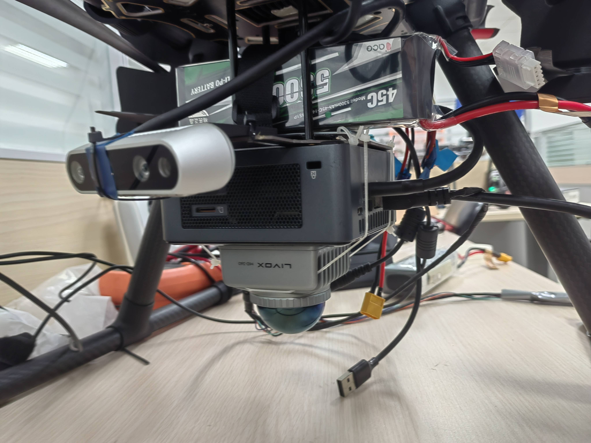

# SPTG-LCC: Single-shot, Pixel-level, Target-free and General LiDAR-Camera Extrinsic Self-Calibration
The data fusion of LiDAR and camera holds vast application prospects, with calibration as a crucial prerequisite. In this paper, we propose SPTG-LCC, a novel, general, and target-free LiDAR-camera extrinsic calibration framework. On the one hand, SPTG-LCC  is open-source, which is very suitable for practitioners seeking a robust, general, and convenient target-free calibration tool. On the other hand, the four diverse datasets are open-source, which is very suitable for researchers to comprehensively evaluate feature-based target-free LiDAR-camera calibration methods.


# Video Link: [Video on Youtube](https://www.youtube.com/watch?v=qKA_KamtwTk) 
# To Do List
The following tasks will be completed quickly and step by step.
 
## Experimental Video
- [x] Video Link:  [Video on Youtube](https://www.youtube.com/watch?v=qKA_KamtwTk) **Completed**
##  Paper Release
- [ ] Paper Link：
## Datasets open-source
our  self-assembled  sensor suites as follows, where the camera is the Realsense D455  and ZED 2i. Four diverse datasets were collected using these four suites,  named **FB-LCC-NS360**, **FB-LCC-NS70**,  **FB-LCC-RS16**, and **FB-LCC-MEMS-M1**,  which are released for evaluating feature-based LiDAR-camera calibration methods. Moreover, sequence 00 on the public KITTI odometry benchmark  is evenly divided into 67 LiDAR-camera data pairs as a dataset, named **FB-LCC-RS-KITTI-VLP-64**.  
|| |
|--------------------------------------------|--------------------------------------------|
- [x] Reference values ​​of extrinsic parameters of the sensor suite in the dataset: Reference_calibration matrix.yaml **Completed**
- [ ] FB-LCC-NS360 :  
- [ ] FB-LCC-NS70 :
- [x] FB-LCC-RS16 : [Baidu Cloud Disk](https://pan.baidu.com/s/1cqg4VAdqK6Zdf-HeuskbGw?pwd=l3jo )   **Completed**
- [x] FB-LCC-MEMS-M1 :  [Baidu Cloud Disk](https://pan.baidu.com/s/1acPQ5RdGDKxyb62OjBmeRA?pwd=zpus ) **Completed**
- [x] FB-LCC-RS-KITTI-VLP-64 : [Baidu Cloud Disk](https://pan.baidu.com/s/17NBXiui3NjhHaQtuMu_A7w?pwd=qjmp ) **Completed**
## Code open-source
- [x] **Docker images tool** : **Completed**
- [x] main code : **Completed**
- [ ] test code
## Simplified code and Docker image
- [ ] Simplified code  
- [ ] Simplified Docker image
## Important parameter description
- [ ] parameter description
## Environment Setup
### 1. main code
```bash
git clone https://github.com/NKU-MobFly-Robotics/SPTG-LCC.git
```
Assuming the folder where the code is downloaded locally is：
**/home/wyw/SPTG-LCC**

Check the folder where you cloned the code and replace the example folder（**/home/wyw/SPTG-LCC**） in all the following commands
### 2. Docker images download
Docker images: [Baidu Cloud Disk](https://pan.baidu.com/s/19RhQFETtDL3i32-Zuu_qsw?pwd=88bc)
### 3. catkin_make
#### 1. Building an Docker Image
```bash
docker load -i sptg-lcc.tar  
```

#### 2. Building an Docker container from image
```bash
sudo docker run -it -v  /home/wyw/SPTG-LCC:/calib_data -v /tmp/.X11-unix:/tmp/.X11-unix -e DISPLAY=$DISPLAY --net=host -e GDK_SCALE   -e GDK_DPI_SCALE  --privileged --gpus all -e NVIDIA_DRIVER_CAPABILITIES=all --name SPTG-LCC  sptglcc:latest   bash
```

#### 3. Start Docker Image
```bash
sudo docker start SPTG-LCC
```
#### 4. Enter the  Docker Image
```bash
sudo docker exec -it  SPTG-LCC bash
```
#### 5. catkin_make code
```bash
cd /calib_data/direct_lidar_camera
```
```bash
conda deactivate
```
```bash
source /opt/ros/noetic/setup.bash
```
```bash
catkin_make
```
### 4. weights download
Download the weight file and put it in the following folder respectively
#### 1. Download EfficientLoFTR weights 
```bash
cd /home/wyw/SPTG-LCC/matcher/Efficinet_LOFTR/EfficientLoFTR && mkdir weights
```
EfficientLoFTR weights: [Baidu Cloud Disk](https://pan.baidu.com/s/1NWqDHi0ToYTAiInGXLPouA?pwd=e6x4)
#### 2. Download superpoint-Lightglue weights
```bash
cd /home/wyw/SPTG-LCC/matcher/LightGlue 
```
superpoint: [Baidu Cloud Disk](https://pan.baidu.com/s/1fSlU3NlwKFXELkonTQvpKA?pwd=52xi)
superpoint_lightglue [Baidu Cloud Disk](https://pan.baidu.com/s/1Qoin3yFc_2sUnDt_i9eC-g?pwd=yesa)
#### 2. Download mono_depth weights
```bash
cd /home/wyw/SPTG-LCC/mono_depth/Marigold/ 
```
mono_depth weights（The entire folder）: [Baidu Cloud Disk](https://pan.baidu.com/s/1HfigXw1MaHMo_uBPcEYM-w?pwd=x998)
### 5. Start calibration

#### 1. Put your test bag package into the following folder
```bash
cd /home/wyw/SPTG-LCC/SPTG-LCC/bag
```
**The rosbag needs to contain the camera image topic, the intrinsic parameters topic, and the lidar topic.**  

**Modify your topic name in the yaml file in the config folder**  

/home/wyw/SPTG-LCC/direct_lidar_camera/src/direct_visual_lidar_calibration/config

**Rosbag example for testing** : [Baidu Cloud Disk](https://pan.baidu.com/s/14RY8c3Ts27JoXsZjp3G3xQ?pwd=gzsq)  

#### 2. Run the script
```bash
cd /home/wyw/SPTG-LCC
```
```bash
chmod +x LiDAR_Camera_calib.sh
```
```bash
./LiDAR_Camera_calib.sh
```
#### 3. The results are saved in the following path
The final result is the latest txt file.
```bash
cd /home/wyw/SPTG-LCC/SPTG-LCC/results
```

##### The following is the collection device and calibration results of the above test data
<table>
  <tr>
    <td width="50%" align="center">
      
    </td>
    <td width="50%" align="center">
      
    </td>
  </tr>
</table>

 
#### 4. If you want to see the coloring effect of the point cloud
```bash
chmod +x Alignment_Effect.sh
```
```bash
./Alignment_Effect.sh
```

#### 5. If you want to view LiDAR images and visual images
```bash
cd /home/wyw/SPTG-LCC/SPTG-LCC/data
```
|| |
|--------------------------------------------|--------------------------------------------|

|| |
|--------------------------------------------|--------------------------------------------|
### 6. Note
If there is no docker on the host, you need to install docker and nvidia-container-toolkit so that docker can perform visualization and call the GPU.

#### 1.Docker 
##### Method 1-One-click installation (recommended)
```bash
wget http://fishros.com/install -O fishros && . fishros
```
##### Method 2-Docker official website
```bash
https://docs.docker.com/engine/install/ubuntu/#install-using-the-repository
```
#### 2. nvidia-container-toolkit
```bash
https://docs.nvidia.com/datacenter/cloud-native/container-toolkit/latest/install-guide.html
```
```bash
https://blog.csdn.net/dw14132124/article/details/140534628?spm=1001.2101.3001.6650.6&utm_medium=distribute.pc_relevant.none-task-blog-2%7Edefault%7EBlogCommendFromBaidu%7ERate-6-140534628-blog-140452570.235%5Ev43%5Epc_blog_bottom_relevance_base1&depth_1-utm_source=distribute.pc_relevant.none-task-blog-2%7Edefault%7EBlogCommendFromBaidu%7ERate-6-140534628-blog-140452570.235%5Ev43%5Epc_blog_bottom_relevance_base1&utm_relevant_index=13
```
Successful execution of the following command indicates successful installation
```bash
sudo apt-get install -y nvidia-container-toolkit
```
# Acknowledgements  
- We sincerely appreciate the following open-source projects: [DVLC](https://github.com/koide3/direct_visual_lidar_calibration), [KITTI](https://www.cvlibs.net/datasets/kitti/), [Lightglue](https://github.com/cvg/LightGlue), [Efficient-LoFTR](https://github.com/zju3dv/EfficientLoFTR), [Marigold](https://github.com/prs-eth/Marigold), [Superpoint](https://github.com/rpautrat/SuperPoint). 
- In particular, our code framework is based on [DVLC(direct_visual_lidar_calibration)](https://github.com/koide3/direct_visual_lidar_calibration), thanks to this great open-source work.
